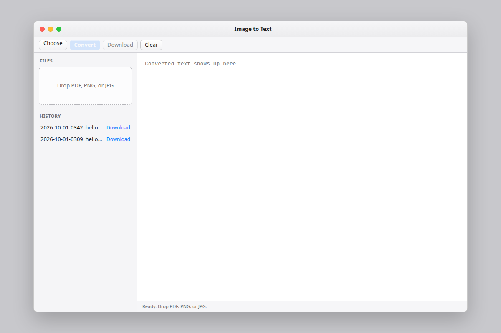

# Image to Text

Mac app that turns a PDF, PNG, or JPG into text on your computer. It uses [baidu/Unlimited-OCR](https://huggingface.co/baidu/Unlimited-OCR). The file is not uploaded to a writing service.

**Download:** [Image to Text (zip)](https://github.com/Eshan-khan1/image-to-text/archive/refs/heads/cursor/complete-image-to-text-d871.zip)

Unzip that file, then follow [Open it on a Mac](#open-it-on-a-mac) below.



## What it does

- Reads PDF, PNG, and JPG files, including more than one file at a time.
- Shows the text in the window. You can download it as a `.txt` file.
- Keeps past conversions in History. Click a row to open it again.
- Runs the reader on this Mac. Apple Silicon uses a local MLX model. The text stays in History on this computer.

## The window

The left side is the file list and History. The toolbar is Choose, Convert, Download, and Clear. The text appears on the right. The status line at the bottom tells you when the reader is ready, working, or finished.

Drop a file on the Files area, or click Choose. Then click Convert.

## What you need

| | |
| --- | --- |
| Computer | Apple Silicon Mac (M1 or newer) |
| System | macOS 14 or newer |
| First run | Python 3.12, an internet connection once to download the reader |

The first conversion can take several minutes while the model loads. Later pages are the same reader, already on the machine.

## Privacy

The window talks only to a server on this Mac at `127.0.0.1:8766`. History is saved under `~/Library/Application Support/Image to Text/History` on a Mac. There is no account and no project telemetry.

## Open it on a Mac

1. Download and unzip [Image to Text (zip)](https://github.com/Eshan-khan1/image-to-text/archive/refs/heads/cursor/complete-image-to-text-d871.zip).
2. Open Terminal, go into the unzipped folder, and run:

```bash
bash scripts/install.sh
swiftc -O -target arm64-apple-macosx14.0 \
  -sdk "$(xcrun --show-sdk-path)" \
  -framework AppKit -framework WebKit \
  -o "Image to Text.app/Contents/MacOS/Image to Text" App.swift
codesign --force --deep -s - "Image to Text.app"
open "Image to Text.app"
```

The app starts the reader and opens the window. Xcode Command Line Tools must be installed so `swiftc` can build the window (`xcode-select --install`).

## Project page

Repository: https://github.com/Eshan-khan1/image-to-text

The same window is available in a browser from the project folder:

```bash
.venv/bin/python app.py
```

Then open http://127.0.0.1:8766.

From the terminal:

```bash
.venv/bin/python app.py photo.png notes.pdf
```

Apple Silicon uses the 8-bit model (`mlx-community/Unlimited-OCR-8bit`). Other computers use the 4-bit model so it fits in memory. Set `OCR_MODEL` to pick a different model. A page can take several minutes on a CPU.
